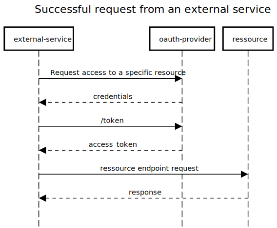

<h1>OAuth 2.0 Provider | Golang</h1>  
 

![Code-Style][code-style]
[![MIT License][license-shield]][license-url]
[![made-with-Go][made-with-go]][golang-url]
  

  
Table of Contents

  <ol>
    <li>
      <a href="#about-the-project">About The Project</a>
    </li>
    <li><a href="#requirements">Requirements</a></li>
    <li><a href="#setup">Setup</a></li>
    <li><a href="#model-description">Model Description</a></li>
    <li><a href="#erd">ERD</a></li>
    <li><a href="#sequence-diagram">Sequence Diagram</a></li>
    <li><a href="#tech-stack">Tech stack</a></li>
    <li><a href="#contact">Contact</a></li>
    <li><a href="#acknowledgements">Acknowledgements</a></li>
  </ol>

## About The Project
Hi guys, a few days ago I was wondering how an OAuth Provider actually works. In order to get a deeper understanding, besides doing research, I decided to create one myself. So this project is for research purposes only. But feel free to look around and have fun :).

## Requirements
* docker
* go version >= 1.18

## Setup
The Setup is very simple. Just follow the two steps below:
1. git clone ...
> Pull the project from Github
2. Removing the dist wording from the .env.dist filename
   - .env.dist -> .env
   - replace the dummy values

2. docker-compose up
> Start the Application.

## Model Description
### User
Each person who wants to use the Oauth provider must be a user.

### AccessGroup
The AccessGroup is responsible for giving each user certain rights in the oauth-provider. For example, there can be two AccessGroups. One for admins and one for normal users. The admin can add new users, add additional resources, manage access rights... while the normal user can only access their own credentials and the resources assigned to them.

### Ressource
Each resource simply represents an endpoint.

### Scope
With the scope, the user can further restrict the access of external services to individual resources. For example, a service can access a resource but only read it.

### Credentials
Each external service must create credentials. With these credentials, the service can create a token that allows access to the authorised resources.

## ERD

## Sequence Diagram

## Tech stack
This section lists the main tech stack I used for this project.
* [Go](https://go.dev/)
* [Gin](https://github.com/gin-gonic/gin)
* [MongoDB](https://www.mongodb.com/)
* [Docker](https://www.docker.com/)

## Contact

[![][link-name]](https://steinhauer.dev) [![][link-email]](mailto:hello@steinhauer.dev) [![][link-twitter]](https://twitter.com/H3nSte1n) [![][link-medium]](https://henrysteinhauer.medium.com/)

## Acknowledgements

- [Img Shields](https://shields.io)
- [README Template](https://github.com/othneildrew/Best-README-Template/blob/master/README.md)

<!--shield-styles-->

[style-plastic]: https://img.shields.io/badge/plastic-83A603.svg?style=plastic
[style-flat]: https://img.shields.io/badge/flat-83A603.svg?style=flat
[style-flat-square]: https://img.shields.io/badge/flat_square-83A603.svg?style=flat-square
[style-for-the-badge]: https://img.shields.io/badge/for_the_badge-83A603.svg?style=for-the-badge
[style-social]: https://img.shields.io/badge/social-83A603.svg?style=social
[link-name]: https://img.shields.io/badge/Henry_Steinhauer-469C90.svg?link=https://github.com/
[link-email]: https://img.shields.io/badge/Mail-informational?style=flat&logo=Minutemailer&logoColor=white&color=469C90
[link-twitter]: https://img.shields.io/badge/Twitter-informational?style=flat&logo=Twitter&logoColor=white&color=469C90
[link-github]: https://img.shields.io/badge/Github-informational?style=flat&logo=GitHub&logoColor=white&color=469C90
[link-medium]: https://img.shields.io/badge/Medium-informational?style=flat&logo=Medium&logoColor=white&color=469C90
[logo-nuxt]: https://img.shields.io/badge/Nuxt-informational?style=flat&logo=nuxt.js&logoColor=white&color=469C90
[logo-typescript]: https://img.shields.io/badge/Typescript-informational?style=flat&logo=typescript&logoColor=white&color=469C90
[logo-express]: https://img.shields.io/badge/Express-informational?style=flat&logo=express&logoColor=white&color=469C90

<!--infos-->
[code-style]: https://github.com/H3nSte1n/go-oauth-provider/workflows/golangci-lint/badge.svg?style=flat
[license-shield]: https://img.shields.io/badge/License-MIT-yellow.svg?style=flat
[license-url]: https://github.com/H3nSte1n/go-oauth-provider/blob/master/LICENSE
[made-with-go]: https://img.shields.io/badge/Made%20with-Go-1f425f.svg?style=flat
[golang-url]: http://golang.org
